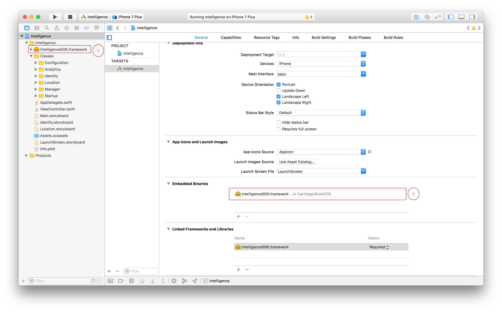

# Intelligence SDK #

The goal of this SDK is to encapsulate in a developer-friendly manner the Intelligence platform's API's.

# Getting Started #

## I. Adding IntelligenceSDK ##

In this section, we detail how to Integrate IntelligenceSDK for both Objective-C and Swift based projects.

We can import the SDK through Cocoapods, Carthage or Import Manually to your application

### A) Through Cocoapods ###

Intelligence is available via CocoaPods. [Cocoapods](https://git-apac.internal.tigerspike.com/phoenix/Phoenix-Intelligence-iOS-SDK/blob/Documentation/Examples/CocoaPods/Swift/Intelligence/ReadMe.md). If you're new to CocoaPods, You can install it with the following command:

```
    $ sudo gem install cocoapods

```

For more info refer [Getting Started Guide](https://guides.cocoapods.org/using/using-cocoapods.html).

To integrate IntelligenceSDK into your Xcode project, navigate to the directory that contains your project and create a new Podfile with "pod init" or open an existing one, then add pod 'IntelligenceSDK' to the main loop. If you are using the Swift SDK, make sure to add the line use_frameworks!.

```
    $  pod init

```

Open the Podfile created for your application and add the following to your target:

```

    target 'YourTargetName' do
        use_frameworks!
        pod 'IntelligenceSDK'
    end

```

Then, run the following command to install the dependency:

```
   
    pod install

```

This creates a .xcworkspace file for your application. Use this file for all future development on your application.

Remember to close any current XCode sessions and use the file ending in .xcworkspace after installation. If you open your .xcworkspace file, you should be able to see the IntelligenceSDK folder under the Pods folder.


For Objective-C projects, set the "Embedded Content Contains Swift Code" flag in your project to Yes (found under Build Options in the Build Settings tab).


To support Swift 2.0 and IOS deployment target 7.0 add the following and run pod install:

```
    target :YourTargetName do
        pod 'IntelligenceSDK’, :git => 'https://git.tigerspike.com/phoenix/Phoenix-Intelligence-iOS-SDK.git', :branch => 'Swift-2.0'
    end

```

Congratulations, you've added the Intelligence iOS SDK into your project using CocoaPods! Next, To Integrate Intelligence API's.

### B) Through Carthage ###

Intelligence is available via Carthage.You can integrate Intelligence into your project using Carthage. If you're new to Carthage, check out their [documentation](https://github.com/Carthage/Carthage) first.

You can install Carthage (with XCode 7+) via homebrew:

```

    brew update
    brew install carthage

```

To install IntelligenceSDK via Carthage, you need to create a Cartfile. In the root directory of your project, run the following command:

```

    touch cartfile

```

In the editor of your choice open the file and add the following:

```

    binary "https://s3-ap-southeast-1.amazonaws.com/chethansp007.sample/IntelligenceFramework.json" ~> 2.0

```

##### To use the specific version of the library(eg:1.0): #####

```

    binary "https://s3-ap-southeast-1.amazonaws.com/chethansp007.sample/IntelligenceFramework.json" == 1.0

```


Now run the following command to checkout & build our repo and dependencies.

```

    carthage update 

```

You should now have a Carthage/Build folder in your project directory. Open your .xcodeproj and go to the General settings tab. In the Linked Frameworks and Libraries section, drag and drop each framework (in Carthage/Build/iOS)

Now, open your application target's Build Phases settings tab, click the + icon, and select New Run Script Phase. Add the following to the script area:

```

    /usr/local/bin/carthage copy-frameworks

```

and add the paths to the required frameworks in Input Files

```

    $(SRCROOT)/Carthage/Build/iOS/IntelligenceSDK.framework

```

For Objective-C projects, set the Embedded Content Contains Swift Code flag in your project to Yes (found under Build Options in the Build Settings tab).

Congratulations, you've added the Intelligence iOS SDK into your project using Carthage! 
To Integrate Intelligence API.

### C) Manual Integration ###

Integrating the Intelligence SDK through [Framework](https://git-apac.internal.tigerspike.com/phoenix/Phoenix-Intelligence-iOS-SDK/blob/Documentation/Examples/Through_Framework/Swift/Intelligence/ReadMe.md)(Manual Integration).

1.    Download the Intelligence framework from the [Github](https://github.com/tigerspike/Intelligence-iOS-Framework/blob/master/SDK).

2.    Drag and drop the Intelligence framework into your project, as shown in part-1.


3. Include the Intelligence framework in Embedded Binaries as shown in part-2.


## II. Import SDK ##

Next, import the IntelligenceSDK framework.

*Swift:*

```
    #!swift
    import IntelligenceSDK
```

*Objective-C:*

```
    #!objc
    @import IntelligenceSDK;

```

## III. Create & Configure your Account ##

Before using the SDK you need an Intelligence account. If you do not have an Intelligence account please reach out to intelligence.support@tigerspike.com. For Tigerspiker request an account here [here](https://sites.google.com/tigerspike.com/intelligence/join-in?authuser=1).


### III.1 Configuration JSON File ###

IntelligenceSDK require configuration JSON file for each project.
All of these variables come from the Intelligence Platform and will need to be included in a JSON file bundled with your iOS App:

1. "client_secret" (String): Application client secret key(Only provided when the project is created.).
3. "client_id" (String): Application Client ID(Only provided when the project is created.).
2. "application_id" (Integer):  Your intelligence Application id.
4. "project_id" (Integer): Your intelligence project id.

As an example, create your configuration file(intelligence.json) should look something like below:

```
    {
        "client_id": "CLIENT_ID",
        "client_secret": "CLIENT_SECRET",
        "application_id": 10,
        "project_id": 20    
    }

```

### III.2 Initialization ###

The Intelligence SDK requires a delegate and configuration variables in order to initialize itself. The delegate will be called in cases where the SDK is incapable of continuing in a particular state, such as requesting that the user must login again.


#### 1. There are a few different ways of providing configuration to the SDK: ####

A)  Initialize Intelligence with a configuration file:

*Swift:*

```
#!swift

    do {
        let intelligence = try Intelligence(withDelegate: self, file: "IntelligenceConfiguration")
    }
    catch {
    // Treat the error with care!
    }

```

*Objective-C:*

```
#!objc

    // Attempt to instantiate Intelligence using a JSON file.
    NSError *err;
    Intelligence *intelligence = [[Intelligence alloc] initWithDelegate: self file:@"IntelligenceConfiguration" inBundle:[NSBundle mainBundle] error:&err];
    if (nil != err) {
        // Handle error, developer needs to resolve any errors thrown here, these should not be visible to the user
        // and generally indicate that something has gone wrong and needs to be resolved.
        NSLog(@"Error initialising Intelligence: %zd", err.code);
        }
    NSParameterAssert(err == nil && intelligence != nil);

```

B) Initialize a configuration object, read a file and pass it to Intelligence:

*Swift:*

```
#!swift

    do {
        let configuration = try Intelligence.Configuration(fromFile: "IntelligenceConfiguration")
        intelligence = try Intelligence(withDelegate: self, configuration: configuration)
    }
    catch {
    // Treat the error with care!
    }

```

*Objective-C:*

```
#!objc

    // Attempt to instantiate Intelligence using a JSON file.
    NSError *err;
    INTConfiguration *configuration = [[INTConfiguration alloc] initFromFile:@"IntelligenceConfiguration" inBundle:[NSBundle mainBundle] error:&err];
    Intelligence *intelligence = [[Intelligence alloc] initWithDelegate: self configuration:configuration error:&err];
        if (nil != err) {
        // Handle error, developer needs to resolve any errors thrown here, these should not be visible to the user
        // and generally indicate that something has gone wrong and needs to be resolved.
        NSLog(@"Error initialising Intelligence: %zd", err.code);
    }
    NSParameterAssert(err == nil && intelligence != nil);

```

C) Programmatically set the required parameters in the configuration, and initialize Intelligence with it.

*Swift:*

```
#!swift

    let configuration = Intelligence.Configuration()
    configuration.clientID = "YOUR_CLIENT_ID"
    configuration.clientSecret = "YOUR_CLIENT_SECRET"
    configuration.projectID = 123456789
    configuration.applicationID = 987654321

```
*Objective-C:*

```
#!objc

    INTConfiguration *configuration = [[INTConfiguration alloc] init];
    configuration.clientID = @"YOUR_CLIENT_ID";
    configuration.clientSecret = @"YOUR_CLIENT_SECRET";
    configuration.projectID = 123456789;
    configuration.applicationID = 987654321;

```


#### 2. The class which instantiating the Intelligence should confirm to IntelligenceDelegate. ####

*Swift:*

```
    extension YourClass : IntelligenceDelegate {

    /// Credentials provided are incorrect. Will not distinguish between incorrect client or user credentials.
    func credentialsIncorrect(for intelligence:
    Intelligence) {
    }

    /// Account has been disabled and no longer active. Credentials are no longer valid.
    func accountDisabled(for intelligence: Intelligence) {
    }

    /// Account has failed to authentication multiple times and is now locked. Requires an administrator to unlock the account.
    func accountLocked(for intelligence: Intelligence) {
    }

    /// Token is invalid or expired, this may occur if your Application is configured incorrectly.
    func tokenInvalidOrExpired(for intelligence: Intelligence) {
    }

    /// Unable to create SDK user, this may occur if a user with the randomized credentials already exists (highly unlikely) or your Application is configured incorrectly and has the wrong permissions.
    func userCreationFailed(for intelligence: Intelligence) {
    }

    /// User is required to login again, developer must implement this method you may present a 'Login Screen' or silently call identity.login with stored credentials.
    func userLoginRequired(for intelligence: Intelligence) {
    // Present login screen or call identity.login with credentials stored in Keychain.
    }

    /// Unable to assign provided sdk_user_role to your newly created user. This may occur if the Application is configured incorrectly in the backend and doesn't have the correct permissions or the role doesn't exist.
    func userRoleAssignmentFailed(for intelligence: Intelligence) {
    }

}

```

*Objective-C:*


```

/// Credentials provided are incorrect. Will not distinguish between incorrect client or user credentials.
- (void)credentialsIncorrectForIntelligence:(Intelligence * __nonnull)intelligence {
}

/// Account has been disabled and no longer active. Credentials are no longer valid.
- (void)accountDisabledForIntelligence:(Intelligence * __nonnull)intelligence {
}

/// Account has failed to authentication multiple times and is now locked. Requires an administrator to unlock the account.
- (void)accountLockedForIntelligence:(Intelligence * __nonnull)intelligence {
}

/// Token is invalid or expired, this may occur if your Application is configured incorrectly.
- (void)tokenInvalidOrExpiredForIntelligence:(Intelligence * __nonnull)intelligence {
}

/// Unable to create SDK user, this may occur if a user with the randomized credentials already exists (highly unlikely) or your Application is configured incorrectly and has the wrong permissions.
- (void)userCreationFailedForIntelligence:(Intelligence * __nonnull)intelligence {
}

/// User is required to login again, developer must implement this method you may present a 'Login Screen' or silently call identity.login with stored credentials.
- (void)userLoginRequiredForIntelligence:(Intelligence * __nonnull)intelligence {
}

/// Unable to assign provided sdk_user_role to your newly created user. This may occur if the Application is configured incorrectly in the backend and doesn't have the correct permissions or the role doesn't exist.
- (void)userRoleAssignmentFailedForIntelligence:(Intelligence * __nonnull)intelligence {
}

```

## IV. Startup ##

Importantly, the 'startup' method is responsible to bootstrap the SDK, without it, undefined behavior might occur, and thus it's the developer's responsibility to call it before the SDK is used. It is suggested to do so right after the Intelligence object is initialised, but it can be deferred until a more convenient time. You will receive a 'success' flag in the completion block, if this returns false, something is probably incorrectly configured. You should receive an error from one of the IntelligenceDelegate methods.

*Swift:*
```
#!swift

    // Startup all modules.
    intelligence.startup { (success) -> () in               
        // Startup succeeded if success is true.
    }

```

*Objective-C:*

```
#!objc

    // Startup the SDK...
    [intelligence startup:^(BOOL success) {        
        // Startup succeeded if success is true.
    }];

```

### Shutdown ###

When your app is terminated you should call the shutdown method in order for the SDK to do any cleanup and store anything relevant to the next session.

*Swift:*
```
#!swift

    func applicationWillTerminate(application: UIApplication) {
    // Called when the application is about to terminate. Save data if appropriate. See also applicationDidEnterBackground:.
    IntelligenceManager.intelligence.shutdown()
    }

```

*Objective-C:*

```
#!objc

    - (void)applicationWillTerminate:(UIApplication *)application {
    // Shutdown Intelligence in the applicationWillTerminate method so Intelligence has time
    // to teardown properly.
    [[INTIntelligenceManager intelligence] shutdown];
    }

```

## V. Tracking Events ##

**To track a Custom Event:**

*Swift:*
Note: there are some optional fields in Swift that default to zero/nil if missing.

```
#!swift

    // Create custom Event
    let myTestEvent = Event(withType: “Intelligence.Test.Event.Type”)

    // Send event to Analytics module
    intelligence.analytics.track(event: myTestEvent);

```

*Objective-C:*
```
#!objc

    // Create custom Event
    INTEvent *myTestEvent = [[INTEvent alloc] initWithType:@"Intelligence.Test.Event.Type" value:1.0 targetId:5 metadata:nil];

    // Send event to Analytics module
    [intelligence.analytics track:myTestEvent];

```

**How to track a Screen View Event:**

*Swift:*

```
#!swift

// Duration is in seconds and can include fractional seconds
intelligence.analytics.trackScreenViewed("Main Screen", viewingDuration: 5)
```

*Objective-C:*

```
#!objc

    // Duration is in seconds and can include fractional seconds
    [intelligence.analytics trackScreenViewedWithScreenName:@"Main Screen", viewingDuration: 5];

```


### Pause/Resume Tracking ###

Developers are responsible for calling the **pause** and **resume** methods when the app enters the background and foreground respectively. This will cause unexpected results if these methods are not called and skew the analytics gathered by Intelligence. 

*Swift:*
```
#!swift

    func applicationDidEnterBackground(application: UIApplication) {
        IntelligenceManager.intelligence.analytics.pause()
    }

    func applicationWillEnterForeground(application: UIApplication) {
        IntelligenceManager.intelligence.analytics.resume()
    }   
```

*Objective-C:*
```
#!objc

    - (void)applicationDidEnterBackground:(UIApplication *)application {
        [[[INTIntelligenceManager intelligence] analytics] pause];
    }

    - (void)applicationWillEnterForeground:(UIApplication *)application {
        [[[INTIntelligenceManager intelligence] analytics] resume];
    }

```

### Register Device Token ###

As a developer, you are responsible for managing the push notification token, if your app supports login you should register the device token after login succeeds. However, if your app doesn't have login/logout functionality you should register after startup has succeeded. You should also manage whether or not you have previously registered this device token since you would not want to send it multiple times.

An example of how to request the push notification token from Apple:
```
#!swift

    let application = UIApplication.sharedApplication()
    application.registerForRemoteNotifications()
    application.registerUserNotificationSettings(UIUserNotificationSettings(forTypes: .Alert, categories: nil))

```

Here is an example of how to respond to the delegate method 'didRegisterForRemoteNotificationsWithDeviceToken':

*Swift:*
```
#!swift


    func application(application: UIApplication, didRegisterForRemoteNotificationsWithDeviceToken deviceToken: NSData) {
    IntelligenceManager.intelligence.identity.registerDeviceToken(deviceToken) { (tokenId, error) -> Void in
    if error != nil {
    // Failed, handle error.
    } else {
    // Successful! Store tokenId in Keychain you will need the Id in order to unregister.
    }
    }
    }

```

*Objective-C:*
```
#!objc

    - (void)application:(UIApplication *)application didRegisterForRemoteNotificationsWithDeviceToken:(NSData *)deviceToken {
    [[[INTIntelligenceManager intelligence] identity] registerDeviceToken:deviceToken callback:^(NSInteger tokenId, NSError * _Nullable error) {
    if (error != nil) {
    // Failed, handle error.
    } else {
    // Successful! Store tokenId in Keychain you will need the Id in order to unregister.
    }
    }];
    }


```

The 'registerDeviceToken' method can return the following additional errors:

* IdentityError.DeviceTokenInvalidError: Invalid device token provided.

### Unregister Device Token ###

The developer is responsible for unregistering device tokens, they can only be assigned to one user at a time, so if you forget to unregister from the previous user you will continue receiving push notifications meant for another user. In order to unregister, you will need to store the tokenId returned by the 'registerDeviceToken' method then send this before logging out. If your app does not implement the login/logout functionality you will most likely never need to call this method.

*Swift:*
```
#!swift

    IntelligenceManager.intelligence.identity.unregisterDeviceToken(withId: id, callback: { (error) -> Void in
    if error != nil {
    // Failed, handle error.
    } else {
    // Successfully unregistered, clear anything stored in the keychain.
    }
    })

```

*Objective-C:*
```
#!objc

    [[[INTIntelligenceManager intelligence] identity] unregisterDeviceTokenWithId:tokenId callback:^(NSError * _Nullable error) {
    if (error != nil) {
    // Failed, handle error.
    } else {
    // Successfully unregistered, clear anything stored in the keychain.
    }
    }];

```

The 'unregisterDeviceTokenWithId' method can return the following additional errors:

* IdentityError.DeviceTokenNotRegisteredError: Device token is not registered in Intelligence platform. You will receive this error if you try to unregister a token twice, you should handle this as though it was a successful request.
